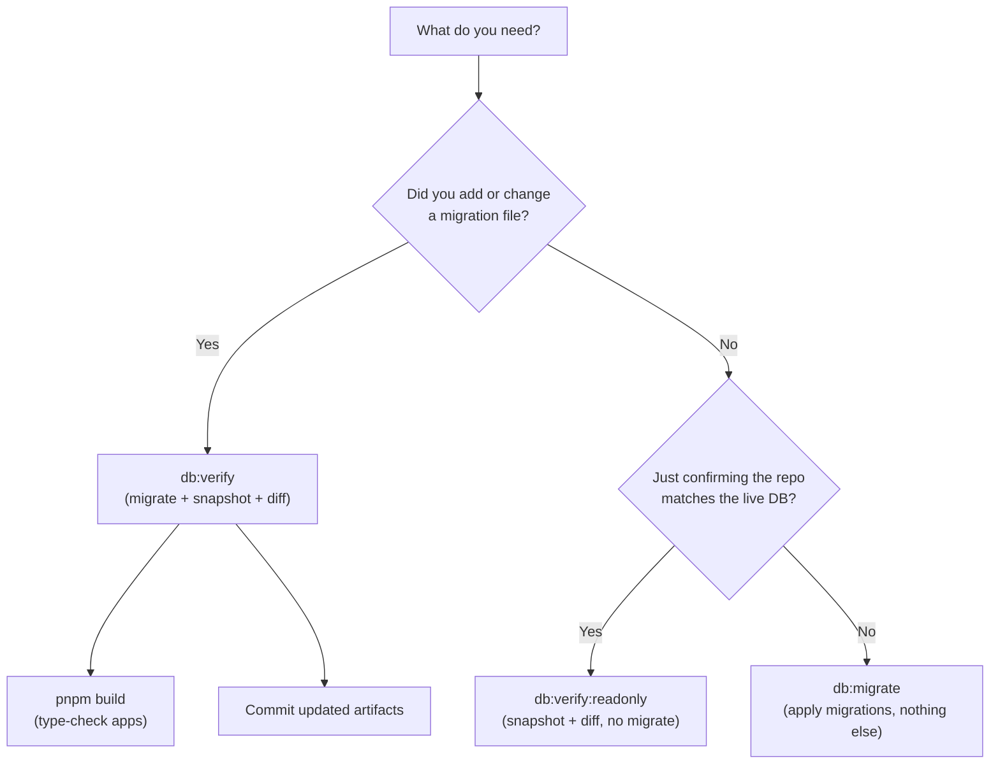

# DB Development & Deployment Guide

This guide explains when to use each database command across three environments: local development, cloud AI agents, and the PR pipeline.

## Command reference

| Command | What it does | Requires `psql` / `pg_dump`? |
|---|---|---|
| `db:migrate` | Apply pending migration files to the database. | No — Node `pg` client only. |
| `db:verify` | Run `db:migrate`, then `pg_dump` the live schema into `schema/current.sql`, regenerate TypeScript/JSON artifacts, run SQL sanity checks, and fail if `git diff` shows uncommitted changes. | Yes — `psql` and `pg_dump` matching the server major version (currently 17). |
| `db:verify:readonly` | Same as `db:verify` but **skips the migrate step**. Use when you want to check the repo against an already-migrated database without applying anything new. | Yes. |

All three commands connect to whatever URL is in the environment variable (`TRADING_DB_URL` or `TIMESCALE_DB_URL`). There is no local temporary database — the scripts always talk to the host in that URL over the network.

## Choosing the right command



## Local development (human on macOS)

### Prerequisites

1. Install PostgreSQL 17 client tools once: `brew install postgresql@17`.
2. Export `TRADING_DB_URL` and `TIMESCALE_DB_URL` in your shell (these are already in `apps/write-node/.env`; source that file or copy the values to your profile).

### "Does my codebase match the production database?"

Run readonly verification against your production URLs:

```bash
pnpm --filter @lib/db-trading db:verify:readonly
pnpm --filter @lib/db-timescale db:verify:readonly
```

If both exit cleanly, the committed `schema/current.sql` and generated types/contracts match the live databases exactly. Nothing was written to the database.

If either fails on the `git diff` step, it means the repo's artifacts have drifted from the live schema — likely someone applied a migration without committing the regenerated files.

### "I wrote a migration and want to apply it"

1. Scaffold a new migration file:

   ```bash
   pnpm --filter @lib/db-trading db:migration:new -- describe_the_change
   ```

2. Write the SQL in the generated file.

3. Apply the migration and verify everything is consistent:

   ```bash
   pnpm --filter @lib/db-trading db:verify
   ```

   This applies the migration, snapshots the live schema, regenerates artifacts, and checks `git diff`. Because you just changed the schema, the diff **will** show changes — that's expected.

4. Type-check the apps:

   ```bash
   pnpm build
   ```

5. Commit the migration file, updated `schema/current.sql`, and regenerated artifacts together.

## Cloud AI agent

### Prerequisites

The `cloud:install` script (`scripts/cloud-agent-install.sh`) automatically installs `postgresql-client-17` when setting up the workspace. The agent's `.env` must contain `TRADING_DB_URL` and `TIMESCALE_DB_URL`.

### "Confirm the codebase matches the database"

Same commands as local:

```bash
pnpm --filter @lib/db-trading db:verify:readonly
pnpm --filter @lib/db-timescale db:verify:readonly
```

### "Apply a migration the agent wrote"

Same as local:

```bash
pnpm --filter @lib/db-trading db:verify
pnpm build
```

**Important:** agents should only run `db:migrate` or `db:verify` (which includes migrate) against the remote database when explicitly instructed to do so. Before running, the agent should confirm the env var is set and review which migrations are pending.

## PR pipeline (GitHub Actions)

The CI workflow (`.github/workflows/db-contracts.yml`) does **not** touch production. It:

1. Spins up an ephemeral Postgres 17 or TimescaleDB container per job.
2. Points `TRADING_DB_URL` / `TIMESCALE_DB_URL` at `localhost`.
3. Runs `db:verify` — which migrates a blank database from scratch, snapshots it, regenerates artifacts, and asserts `git diff --exit-code`.

This proves that the migration files and committed artifacts are self-consistent: applying every migration to an empty database produces the exact schema described by the checked-in `schema/current.sql` and generated types. No production credentials are involved.

### When CI fails

- **`git diff` exit code 1**: the committed artifacts don't match what the migrations produce. Likely fix: run `db:verify` locally (which regenerates the files), then commit the updated artifacts.
- **Migration error**: a SQL syntax or constraint error in a migration file. Fix the migration (if it hasn't been applied to production yet) or add a corrective migration.
- **Missing table/index/constraint assertion**: the SQL sanity checks in `verify-contract.mjs` expect specific objects. If you renamed or removed something, update the assertions too.

## When to use `db:migrate` alone

`db:migrate` by itself is useful in two situations:

1. **Deploy step on a server** — you only need to bring the database up to date. No `pg_dump`, no artifact regeneration, no git checks. This is also the only command that works without PostgreSQL client tools installed.

2. **Iterating on a migration locally** — you want to apply it and test the app before running the full verify cycle. Run `db:migrate`, test the app, then `db:verify` once you're satisfied.
